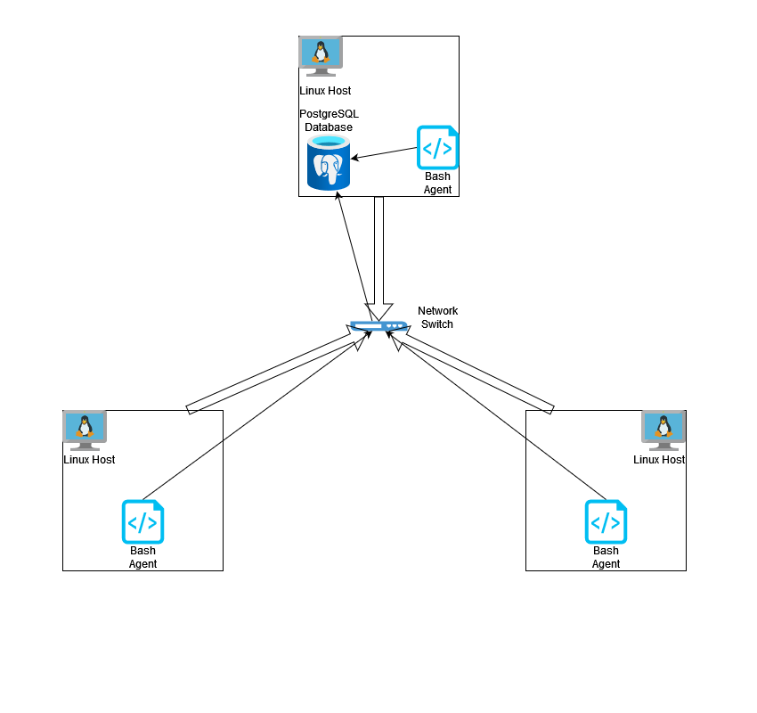

# Linux Cluster Monitoring Agent
This project is under development. Since this project follows the GitFlow, the final work will be merged to the master branch after Team Code Team

# Introduction
This project is an implementation of a Linux cluster monitoring agent. It registers a computer onto the database and tracks its usage data every minute and stores it into the database. System administrators would find this application useful because it lets them see the usage data on different computers in the cluster to see if they would need to adjust the specifications on any of the machines. The technologies used for this project were bash, git, Docker, and PostgreSQL.

# Quick Start
```
# From the home directory of the respository, provision and start a PostgreSQL database using docker
./linux_sql/scripts/psql_docker.sh start

# Initialize the tables in the database
psql -h localhost -U postgres -d host_agent -f sql/ddl.sql

# Insert hardware information data into the database
./linux_sql/scripts/host_info.sh localhost 5432 host_agent db_username db_password

# Insert hardware usage into the database
./linux_sql/scripts/host_usage.sh localhost 5432 host_agent db_username db_password

# Set up a crontab job to automate data usage collection every minute
crontab -e
# Add this to crontab
* * * * * bash ~/dev/jarvis_data_eng_HumzaAfzal/linux_sql/scripts/host_usage.sh localhost 5432 host_agent postgres password > /tmp/host_usage.log
```

# Implementation
A docker container is created wtih a PostgreSQL image in order to run an instance of the database. The bash script psql_docker.sh achieves this. After the database is setup the ddl.sql file is run in order to set up the tables properly in the database. After this, the two bash scripts are run, host_info.sh first in order to collect the hardware specifications of the machine it was run on. host_usage.info is run after in order to collect usage data of the machine. In order to automate this procress a crontab job is added to make the script run by itself every minute.

## Architecture

## Scripts
- psql_docker.sh\
    Used to start, stop or create a PostgreSQL docker container on localhost on port 5432 named host_agent.
    ```
    # Usage
    ./linux_sql/scripts/psql_docker.sh <start | stop | create> [db_username] [db_password]
    ```
    db_username and db_password are only required if using the create command
- host_info.sh\
    Used to collect host information, particularly hostname, CPU number, CPU architecture, CPU mhz, l2 cache, total memory and a timestamp of the data collection.
    ```
    # Usage
    ./linux_sql/scripts/host_info.sh host port db_name db_username db_password
    ```
    Default values of host, port and db_name are localhost, 5432, and host_agent respectively. db_username and db_password are the values user specified when creating the docker container using the psql_docker.sh file.
- host_usage.sh\
    Used to collect host usage information, particularly free memory, idle CPU percentage, kernel CPU usage, disk space used and disk IO.
    ```
    # Usage:
    ./linux_sql/scripts/host_usage.sh host port db_name db_username db_password
    ```
    Default values of host, port and db_name are localhost, 5432, and host_agent respectively. db_username and db_password are the values user specified when creating the docker container using the psql_docker.sh file.
- crontab\
    Used to automate collecting host usage information every minute.
    ```
    # Edit crontab jobs
    crontab -e
    # Add this to crontab
    * * * * * bash ~/dev/jarvis_data_eng_HumzaAfzal/linux_sql/scripts/host_usage.sh localhost 5432 host_agent postgres password > /tmp/host_usage.log
    ```
    This automates the data_usage task by making a cron job that will run on its own every minute.
- queries.sql\
    There are three queries in this file. The first query groups hosts by CPU number and sorts by their memory size. The second query shows the average CPU usage percentage over 5 minute intervals of every host. The last query displays the number of data collections that were done in each given 5 minute interval. If this value is less than 3 then it is considered a failure.
    ```
    # Usage
    psql -h localhost -U postgres -d host_agent -f sql/queries.sql
    ```
    The first query is useful for system admins to be able to monitor how much memory each machine connected in the cluster has. The second script is useful to see which machines need a hardware upgrade and to track the overall usage of the machines connected to the cluster. The final query is useful to see if something has gone wrong on a particular machine.

## Database Modeling
- `host_info`

| id      | hostname | cpu_number | cpu_architecture | cpu_model | cpu_mhz | l2_cache | total_mem | timestamp |
|---------|----------|------------|------------------|-----------|---------|----------|-----------|-----------|
| numeric | variable | numeric    | variable         | variable  | numeric | numeric  | numeric   | timestamp |
- `host_usage`

| timestamp | host_id | memory_free | cpu_idle | cpu_kernel | disk_io | disk_available |
|-----------|---------|-------------|----------|------------|---------|----------------|
| timestamp | numeric | numeric     | numeric  | numeric    | numeric | numeric        |
# Test


# Deployment


# Improvements
