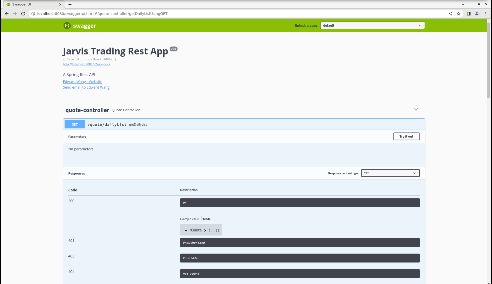
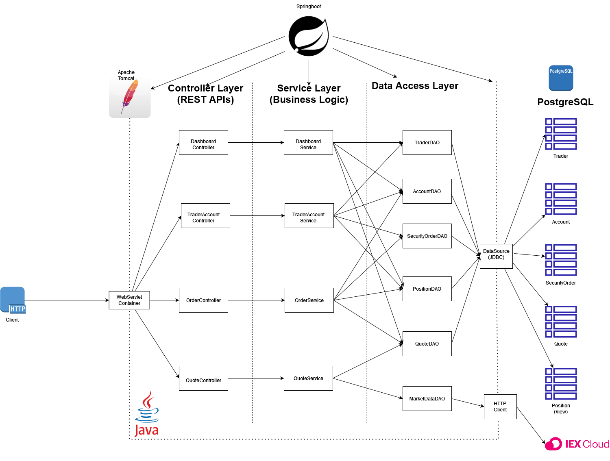
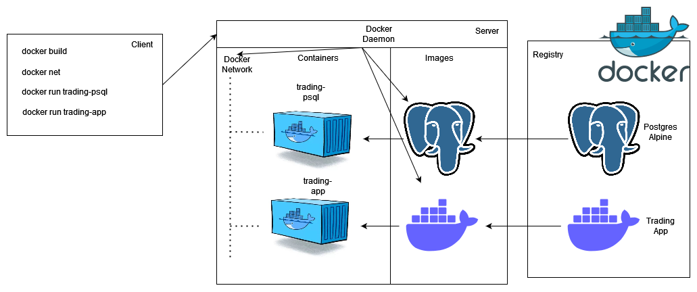

Table of contents
* [Introduction](#Introduction)
* [Quick Start](#QuickStart)
* [Implementation](#Implemenation)
* [Test](#Test)
* [Deployment](#Deployment)
* [Improvements](#Improvements)

# Introduction
This java project is a trading app that lets users register, make an account, and trade in stocks using real-world market data provided through the IEX Cloud API. The data is saved to a PostgreSQL database using JDBC. Currently, it is a proof of concept so no actual trading is being done. This project follows the microservice architecture and the Springboot framework. The project is packaged using docker. SwaggerUI was utilized for the UI on the web browser.

# Quick Start
- Prequiresites: Docker, CentOS 7
- Docker scripts with description
  - Build the docker images
    ```
    # PostgreSQL Image
    cd ./springboot/psql
    docker build -t trading-pqsl .

    # Application Image
    cd ./springboot/
    docker build -t trading-app .
    ```
  - Create a new docker network
    ```
    sudo docker network create trading-net 
    ```
  - Run the docker containers
    ```
    # Run the PostgreSQL image
    docker run --name trading-psql \
    -e POSTGRES_PASSWORD=password \
    -e POSTGRES_DB=jrvstrading \
    -e POSTGRES_USER=postgres \
    --network trading-net \
    -v pgdata:/var/lib/postgresql/data \
    -d -p 5432:5432 trading-psql

    # Set your IEX credential
    IEX_PUB_TOKEN="your_token"

    # Run the application image
    docker run --name trading-app \
    -e "PSQL_URL=jdbc:postgresql://localhost:5432/postgres" \
    -e "PSQL_USER=postgres" \
    -e "PSQL_PASSWORD=password" \
    -e "IEX_PUB_TOKEN=${IEX_PUB_TOKEN}" \
    --network trading-net \
    -p 8080:8080 -t trading-app
    ```
- Try trading-app with SwaggerUI
  

# Implemenation
## Architecture

  - Controller layer
    - Handles user requests by using the REST API. It lets users get quotes, update them with the market value, get their daily list, add a trader and account, delete a trader, and add or withdraw funds through the web user interface made using SwaggerUI.
  - Service layer
    - Assesses the request to ensure business logic is being followed, e.g. Trader and Account must exist before you deposit money, etc.
  - DAO layer
    - Takes the information from the requests and constructs SQL statements so the database can be changed to reflect the changes that happened.
  - SpringBoot: webservlet/TomCat and IoC
    - Springboot is in charge of dependency management and will automatically create the instances of each class that a given class needs to fulfill its role. Springboot also comes with an embedded Apache Tomcat servlet to communicate through HTTP.
  - PSQL and IEX
    - PSQL is used to store data about the traders, accounts, orders, quotes, and positions of traders. It is accessed using a JDBC datasource. IEX is used to get real-time market data and update the quotes stored in the database if needed.

## REST API Usage
### Swagger
  Swagger UI allows anyone, be it your development team or your end consumers, to visualize and interact with the API's resources without having any of the implementation logic in place. It's automatically generated from your OpenAPI (formerly known as Swagger) Specification, with the visual documentation making it easy for back-end implementation and client-side consumption.
### Quote Controller
- The quote controller takes the market data from the IEX Cloud API and caches the data into the quote table in the postgres database.
- List of endpoints
  - GET `/quote/dailyList`: list all securities that are available for trading in this trading system.
  - GET `/quote/iex/ticker/{ticker}`: get a quote of a specific security with the given ticker
  - POST `quote/tickerId/{tickerId}`: create a quote of a specific security with the given tickerId.
  - PUT `/quote/`: puts a quote into the database
  - PUT `/quote/iexMarketData`: updates the cached data from the market data given from IEX Cloud.
### Trader Controller
- The trader controller manages trader and account information. It can also deposit and withdraw funds from existing accounts
- List of endpoints
  - DELETE `/trader/traderId/{traderId}`: deletes a trader by ID.
  - POST `/trader/`: Create a trader with an account.
  - POST `/trader/firstname/{firstname}/lastname/{lastname}/dob/{dob}/country/{country}/email/{email}`: Create a trader with given fields and create an account.
  - PUT `/trader/deposit/traderId/{traderId}/amount/{amount}`: Deposit an amount of money on the given traderId.
  - PUT `/trader/withdraw/traderId/{traderId}/amount/{amount}`: Withdraw an amount of money on the given traderId.
<!---
### Order Controller
- High-level description for this controller.
- briefly explain each endpoint
### App controller
- briefly explain each endpoint
### Optional(Dashboard controller)
- High-level description for this controller.
- briefly explain each endpoint
--->
# Test 
The application was tested using JUnit. Integration tests were made for every class and method that was implemented. The code coverage for service and DAO classes were above 50%.

# Deployment

- The client builds the containers from the images that are pulled from DockerHub
- The client then initializes a docker network that both of the containers that are going to be made can communicate through
- When the client runs the trading-psql image, a container that is connected to the docker network is created. The Postgres image takes the Postgres alpine image from the docker registry and runs the scripts found in the `./psql/` package. `init-db.sql` initializes the database, then the `schema.sql` file creates the schema of the database. This whole process happens in the container that was created.
- The client then runs the trading-app image, which creates a container also connected to the docker network and with all the appropriate environment variables. The app is then ready to be run on the URL `http://localhost:8080/swagger-ui.html`. 

# Improvements
If you have more time, what would you improve?
- Add a controller that allows users to do security orders.
- Add a dashboard that is completely removed from the logic, as right now you need to know JSON and REST API to use the application
- Add a live position tracker that automatically updates your positions once you call the command.